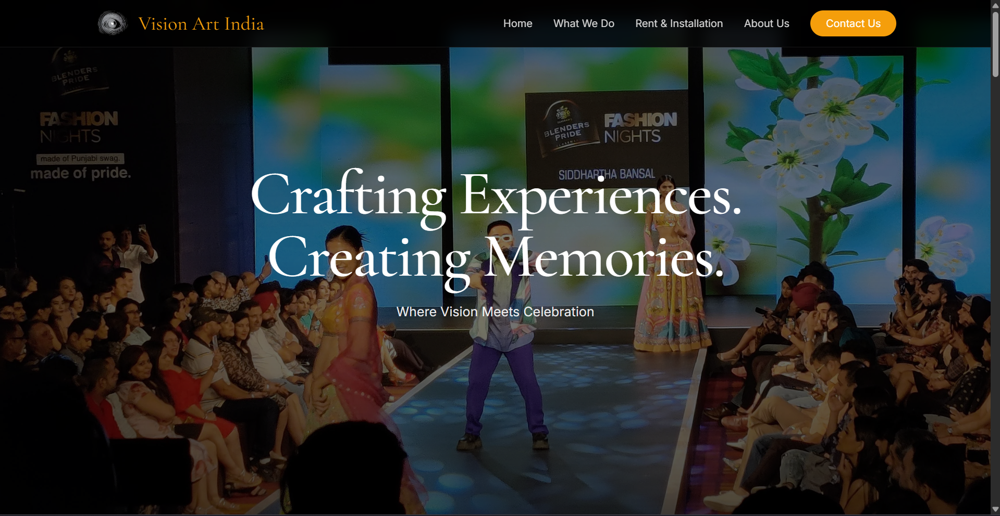
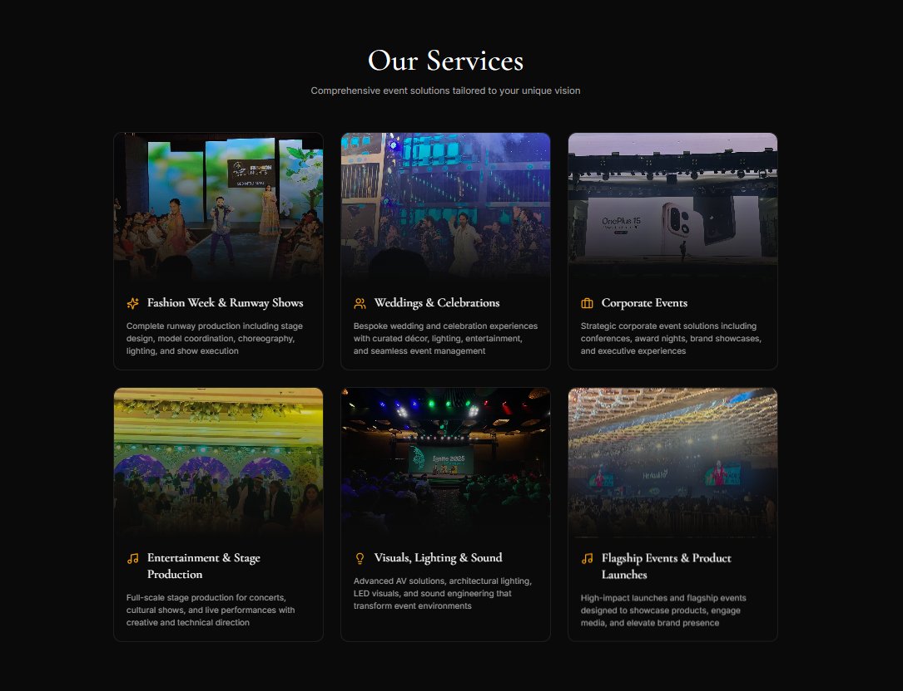
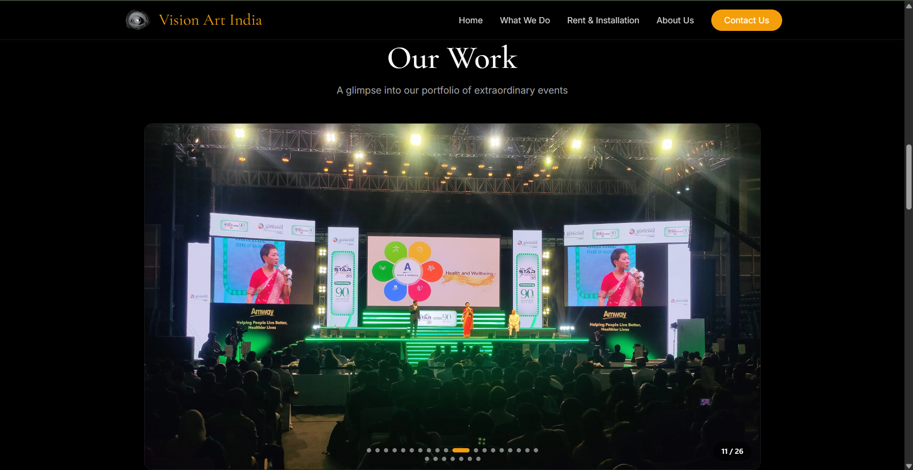
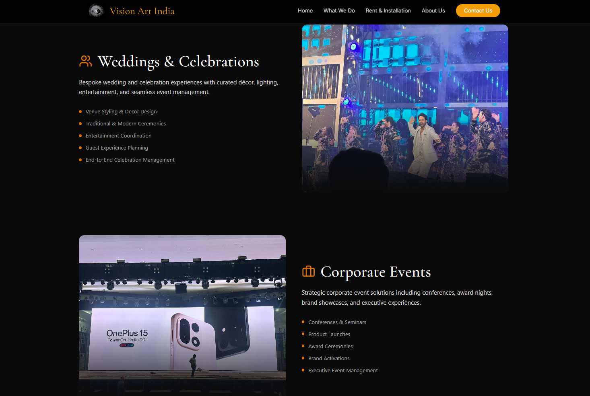
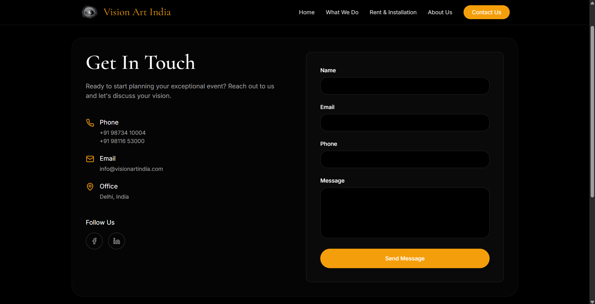
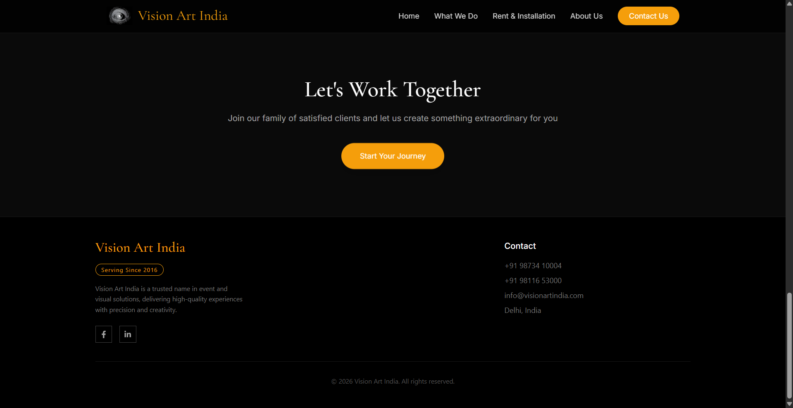
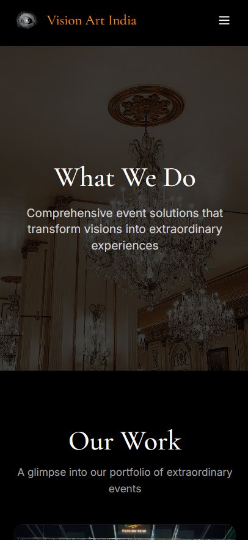
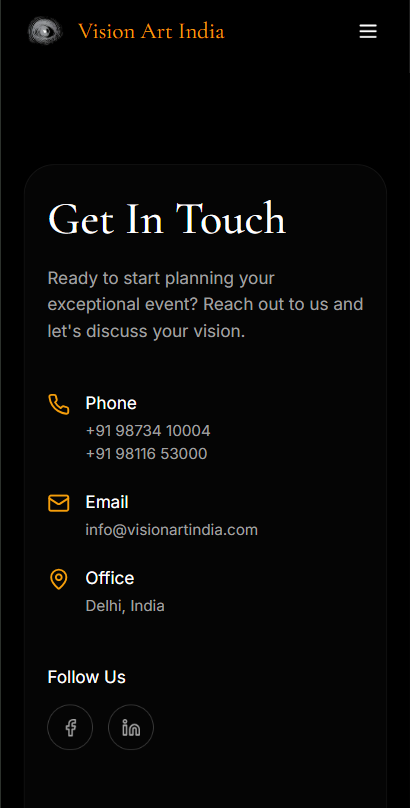
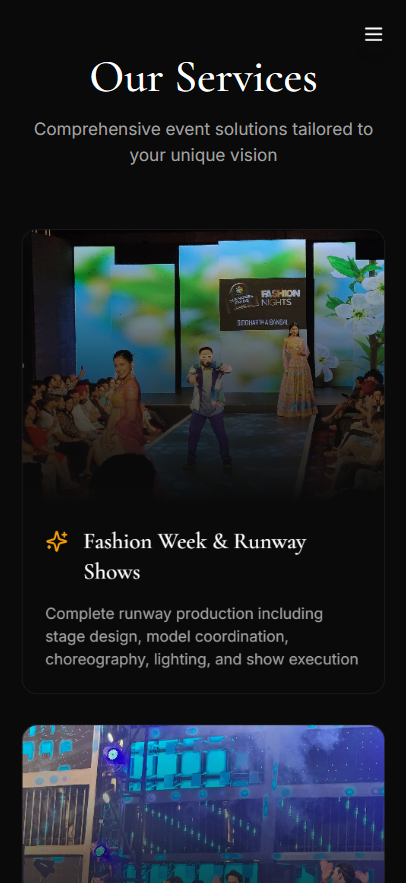

# Vision Art India Website

A freelance website developed for Vision Art India to showcase premium event production services, artistic experiences, portfolio work, and client engagement through a modern, mobile-first web experience.

## Live Demo

🔗 **Live Site:** https://www.visionartindia.com/

---

## Screenshots

### Landing Experience



*Immersive hero section featuring event photography, premium branding, and intuitive navigation designed to showcase Vision Art India's creative identity.*

---

### Services Overview



*Comprehensive service showcase covering fashion shows, weddings, corporate events, stage production, audiovisual solutions, and event management services.*

---

### Event Solutions & Experiences



*Dedicated service pages highlighting tailored event solutions, production capabilities, and end-to-end experience management.*

---

### Portfolio Showcase



*Visual portfolio featuring real-world event executions, large-scale productions, and client success stories across multiple event categories.*

---

### Client Contact & Lead Generation



*EmailJS-powered contact experience enabling prospective clients to connect directly with the team through an integrated inquiry form.*

---

### Call-to-Action & Footer Experience



*Conversion-focused section encouraging user engagement while providing contact information, company details, and social media access.*

---

### Mobile Responsive Design

#### Mobile Service Experience



#### Mobile Contact Experience



#### Mobile Service Cards



*Fully responsive mobile-first design optimized for seamless browsing, portfolio exploration, service discovery, and client communication across devices.*

---

## Features

* Premium hero section with immersive visuals and brand-focused storytelling
* Service showcase covering weddings, fashion shows, corporate events, stage production, audiovisual, and lighting solutions
* Dynamic portfolio gallery with auto-play functionality, manual navigation controls, and smooth visual transitions
* Interactive user experience powered by modern animations and responsive design patterns
* Contact form integrated with EmailJS for direct client inquiries and lead generation
* Mobile-first architecture ensuring seamless performance across devices
* Modern component-based frontend built with React and TypeScript

---

## Tech Stack

### Frontend

* React
* TypeScript
* Vite
* Tailwind CSS

### UI & Animation

* Motion
* Lucide React
* Radix UI

### Services & Integrations

* EmailJS


## Getting Started

### Installation

```bash
git clone <repository-url>
cd vision-art-india
pnpm install
```

Alternatively:

```bash
npm install
```

or

```bash
yarn install
```

### Run Development Server

```bash
pnpm dev
```

Open the local Vite URL displayed in the terminal.

---

## EmailJS Configuration

The contact form is implemented in:

```text
src/app/components/Contact.tsx
```

Configure EmailJS by replacing the placeholder values:

```env
YOUR_PUBLIC_KEY
YOUR_SERVICE_ID
YOUR_TEMPLATE_ID
```

### Setup Steps

1. Create an EmailJS account.
2. Configure an email service.
3. Create an email template.
4. Replace the placeholder credentials in the project.
5. Test form submissions locally before deployment.

---

## Key Highlights

* Developed as a freelance project for a real-world client
* Designed to strengthen Vision Art India's online presence and service visibility
* Focused on visual storytelling through event showcases and portfolio presentation
* Implemented lead-generation workflows using EmailJS integration
* Delivered a polished, responsive, and production-ready website experience
* Optimized for both user engagement and business inquiries


## License

This project was developed for Vision Art India as a freelance engagement and is showcased for portfolio and demonstration purposes.